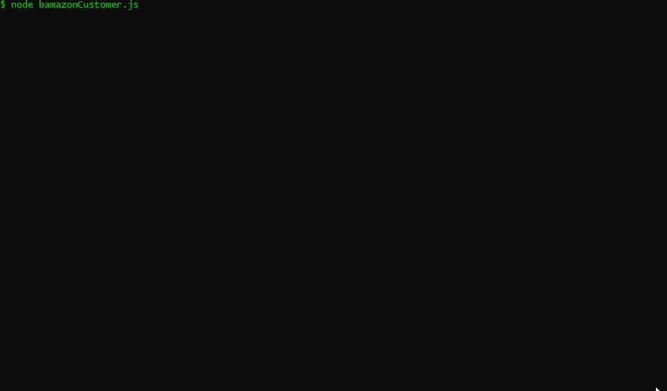
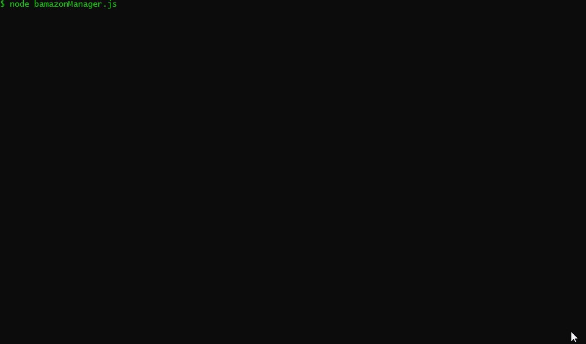

# bAmazon
bAmazon is a series of two CLI APPs which utilize Node.js and MySQL, and simulate an Amazon-like storefront.
1. The Customer App will take in orders from customers and deplete stock from the store's inventory.
2. The Manager App will allow the store manager to do various admin tasks such as update current inventory and add new products for sale.


## Demo Customer App



## Demo Manager App


## Technologies

* NodeJS
* JavaScript
* MySQL
* npm mysql
* npm inquirer
* npm dotenv
* npm cli-table
* npm colors

### npm Module Dependencies
mysql, inquirer, dotenv, cli-table, colors


## Deployment

1. Clone or download repo to your computer
2. Open Git Bash in the root directoy
3. In the terminal run `npm install`
4. Wait for Dependencies to install
5. In the terminal run `node bamazonCustomer.js` to view Customer Interface or `node bamazonManager.js` to view Manager Interface
6. Follow the prompts and enjoy!

### Note - You Will Need to Setup a MySQL Server
* For bAmazon to work, you will need a running MySQL server and will need to add the connection info for your server to a `.env` file in the root directory.
1. If you need to setup a MySQL server, please download and install the server from the following link: <https://dev.mysql.com/downloads/mysql/>.
2. Once you have your MySQL server up and running, create a file named `.env` in the root directory and add the following to it, replacing the values in the quotes with your MySQL server connection info:

```js

# MySQL Connection
HOST='your MySQL server IP'
PORT='your MySQL server Port'
USER='username for connection to MySQL server'
PASSWORD='password for connection to MySQL server'
DATABASE='name of Database on MySQL server'

```


